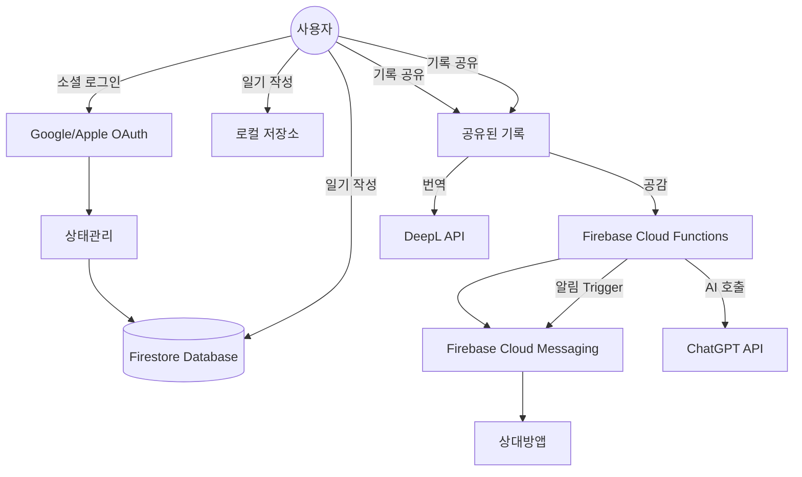

[](https://play.google.com/store/apps/details?id=com.bandi.official)
[](https://apps.apple.com/kr/app/%EB%B0%98%EB%94%94-ai-%EA%B0%90%EC%A0%95-%EC%9D%BC%EC%A7%80/id6717578973)

## 📑 목차

1. [프로젝트 소개](#-프로젝트-소개)  
2. [프로젝트 성과](#-프로젝트-성과)  
3. [기술 스택](#-기술-스택)  
4. [앱 스크린샷](#-앱-스크린샷)  
5. [시스템 아키텍처](#-시스템-아키텍처)  
6. [기술적 도전 과제 & 해결 방법](#-기술적-도전-과제--해결-방법)  
7. [코드 스니펫 (Cloud Functions)](#-코드-스니펫-cloud-functions)  
8. [역할](#-역할)  
9. [배운 점](#-배운-점)  
10. [한 줄 소개](#-한-줄-소개)  

---

## 🌟 프로젝트 소개

**반디(Bandi)** 는 AI 기반 감정 분석과 회고 기능을 제공하는 **일상 감정 관리 플랫폼**입니다.  
Flutter와 Firebase를 기반으로 개발되었으며, 실제 **구글 플레이스토어와 애플 앱스토어에 출시**되어 운영 중입니다.

- 감정 일기 작성 및 자동 감정 키워드 분석  
- ChatGPT 기반 맞춤형 회고 챗봇  
- Firebase Cloud Messaging 기반 푸시 알림  
- DeepL API를 통한 번역 및 다국어 지원  

---

## 📊 프로젝트 성과

✅ iOS AppStore & Android PlayStore 동시 출시  

✅ 예비창업패키지 선정 프로젝트 (경북창조경제혁신센터)  
- [관련 기사 1](https://www.christian-journal.com/news/articleView.html?idxno=1096)  
- [관련 기사 2](http://www.mediagb.kr/news/view.php?idx=34988)  

🏆 SW 창업경진대회 대상 수상  
- [관련 기사 1](https://www.christiandaily.co.kr/news/130618)  
- [관련 기사 2](https://www.christiandaily.co.kr/news/141242)  

🏆 포스텍 미니 아이코어 프로그램 우수상 수상  

---

## 🛠️  기술 스택

- **Frontend**
  - Flutter (Dart), Provider (상태관리)
  - Responsive UI (모바일/태블릿 대응)
- **Backend & Infra**
  - Firebase Firestore (NoSQL DB)
  - Firebase Cloud Functions (Serverless API)
  - Firebase Cloud Messaging (푸시 알림)
  - Firebase Authentication (Google, Apple OAuth)
- **AI & 번역**
  - OpenAI ChatGPT API (감정 분석, 회고 챗봇)
  - DeepL API (다국어 번역 지원)
- **배포**
  - Google PlayStore / Apple AppStore
  - CI/CD 배포 경험  

---

## 🖼️  앱 스크린샷

| 홈 화면 | 감정 일기 작성 | 감정 분석 결과 |
|:---:|:---:|:---:|
|  |  |  |

| 챗봇 회고 | 알림 기능 | 다국어 지원 |
|:---:|:---:|:---:|
|  |  |  |

---

## 🏗️  시스템 아키텍처



---

## 🔥 기술적 도전 과제 & 해결 방법

1. **다국어화 및 번역 토글 구현**
   - PR: [#133 Feature 다국어화(localization) 설정하기](https://github.com/Nein-to-Sick/bandi_official/pull/133)  
   - 내용: Flutter UI 전반과 Firebase Function에 다국어(Localization) 적용, 사용자 입력 일기 공유 시 DeepL API 기반 번역 토글 기능 구현  
   - 의미: 글로벌 사용자 대상 확장 및 플랫폼 내 언어 선택 유연성 강화  

2. **기록 공유의 신고 및 차단 기능 추가**
   - PR: [#144 Release 공유 알고리즘 개선 등](https://github.com/Nein-to-Sick/bandi_official/pull/144)  
   - 내용: 공유된 일기에서 부적절한 콘텐츠에 대한 신고 및 차단 기능 도입, 커뮤니티 안전성 확보  
   - 의미: 사용자 경험 중심의 책임 있는 서비스 운영  

3. **소셜 로그인 자동 무한 루프 오류 해결**
   - PR: [#136 Release 로그인 오류 수정](https://github.com/Nein-to-Sick/bandi_official/pull/136)  
   - 내용: 자동 로그인 시 발생하던 무한 재시도 루프 버그 수정, 안정적인 로그인 흐름 확보  
   - 의미: 원활한 사용자 흐름 보장 및 UX 개선  

4. **계정 탈퇴 기능 안정화 및 코드 개선**
   - PR: [#141 Fix 계정 탈퇴 버그 및 코드 개선](https://github.com/Nein-to-Sick/bandi_official/pull/141)  
   - 내용: 계정 탈퇴 시 무한 로딩 문제 수정, Firebase DB 및 Auth 계정 삭제 로직 정상화, 재인증 기능 보완  
   - 의미: 사용자 신뢰 확보 및 데이터 정합성 유지  

5. **인터넷 미연결 시 에러 핸들링 추가**
   - PR: [#123 Bug 인터넷 연결 시 에러 핸들링](https://github.com/Nein-to-Sick/bandi_official/pull/123)  
   - 내용: 로그인 전 네트워크 연결 여부 확인 및 적절한 에러 메시지 처리 로직 추가  
   - 의미: 네트워크 불안정 상황에서도 앱의 안정성 및 사용자 안내 강화  

---

## 📂 코드 스니펫 (Cloud Functions)

```js
// functions/index.js
const functions = require("firebase-functions");
const admin = require("firebase-admin");
admin.initializeApp();

// 좋아요 발생 시 작성자에게 알림 전송
exports.sendLikedDiaryNotification = functions.firestore
  .document("likes/{likeId}")
  .onCreate(async (snapshot, context) => {
    const likeData = snapshot.data();
    const { diaryId, senderId, receiverId } = likeData;

    // 수신자 FCM 토큰 조회
    const userDoc = await admin.firestore().collection("users").doc(receiverId).get();
    const fcmToken = userDoc.data()?.fcmToken;
    if (!fcmToken) return null;

    // 다이어리 정보 조회
    const diaryDoc = await admin.firestore().collection("diaries").doc(diaryId).get();
    const diary = diaryDoc.data();

    // 알림 메시지 생성
    const message = {
      token: fcmToken,
      notification: {
        title: "새로운 반응이 도착했어요!",
        body: `${senderId}님이 "${diary.title}"에 공감했어요.`,
      },
      data: { type: "like", diaryId },
    };

    // 알림 발송
    await admin.messaging().send(message);
  });
```

---

## 👥 역할

| 이름   | 역할 |
|--------|------|
| 김형진 | Flutter 프론트엔드 & Firebase 백엔드 개발, Cloud Functions 및 서버리스 아키텍처 구현, ChatGPT API 연동 및 최적화, 배포 및 스토어 심사 대응 |
| 김경록 | 팀 내 역할 (디자인/개발 보조) |
| 권세한 | 팀 내 역할 (개발/운영 보조) |

---

## 📌 배운 점

- 앱 심사와 서비스 운영 과정에서 발생하는 **실제 문제 해결 경험** 축적  
- 소셜 로그인, 다국어, 네트워크 등 **실무 난이도 높은 문제 해결 능력 확보**  
- 실제 사용자 피드백 기반으로 **지속적인 개선 사이클** 운영  

---

## ✨ 한 줄 소개

**“실서비스를 개발·출시·운영하며, 복잡한 기술적 문제를 해결할 수 있는 풀스택 모바일 개발 경험”**
